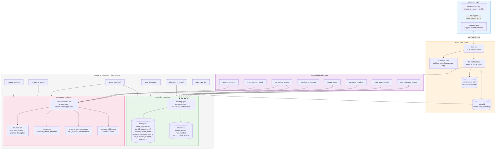

# cs agent draft

architecture overview for the urvann customer support (cs) agent system.

## system architecture

## layers

| layer | description |
|-------|-------------|
| customer | urvann main app routes users to the cs agent app with auth token and transaction id |
| cs agent (new) | chat api, llm orchestrator, conversation store, and policy knowledge base |
| support tools (new) | tool apis for orders, tracking, refunds, stock, tickets, and escalation |
| genie 2.0 (existing) | order tracking, issues, and refund data via mongodb |
| storehippo (existing) | product catalog, orders, returns/refunds, and address management |
